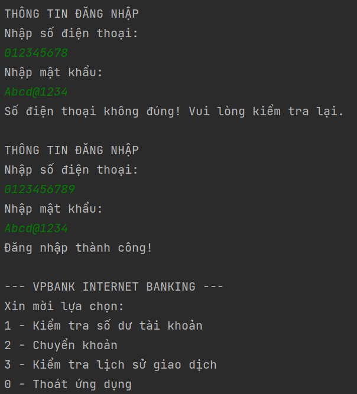
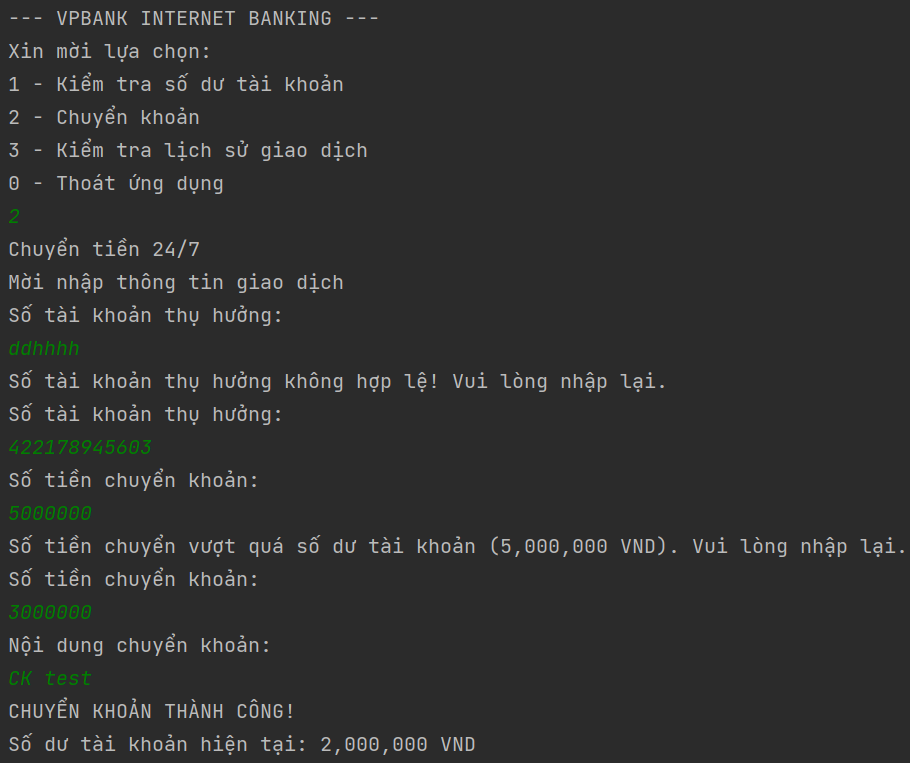
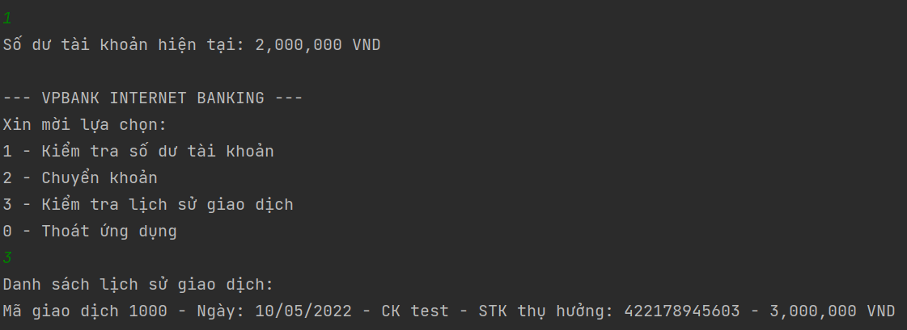

# Internet Banking

Giả sử trong tài khoản VPBank của bạn có 5.000.000 VND

Bạn có thể thực hiện các công việc sau ngay trên ứng dụng VPBank Online:

- Truy vấn số dư tài khoản

- Chuyển tiền

- Xem lịch sử giao dịch

**Tuy nhiên trước khi thực hiện được các công việc đó bạn cần tiến hành đăng nhập:**

- Để đăng nhập cần số điện thoại và mật khẩu. Chỉ cần tạo sẵn biến chứa sđt và mật khẩu:

  - String mobile = "0123456789";
  - String password = "123456789";

- Kiểm tra xem sđt và mật khẩu nhập có giống với thông tin đã cho hay không là được

**Truy vấn số dư tài khoản:** In thông tin số dư hiện tại của bạn

**Chuyển tiền**

- Đầu tiên cần lựa chọn ngân hàng bạn muốn chuyển tiền đến

- Tiếp theo, nhập số tài khoản (stk là các số gồm từ 8 đến 16 ký tự)

- Nhập số tiền bạn muốn chuyển (Số tiền muốn chuyển cần lớn hơn 50.000 và nhỏ hơn số dư tài khoản - 50.000 vì trong tài khoản luôn luôn dư ít nhất là 50.000). Ví dụ: TK của bạn có 500.000 thì bạn chỉ được chuyển nhiều nhất là 450.000

- Nhập mô tả và tiến hành gửi tiền

- Sau khi nhận thông báo chuyển tiền thành công sẽ lưu vào lịch sử giao dịch

**Lịch sử giao dịch**

- Lịch sử giao dịch bao gồm các thông tin như mã giao dịch, ngày giao dịch, mô tả giao dịch,số tài khoản thụ hưởng, số tiền. VD:

  - 1 - 15/6/2021 - Đóng tiền nhà - 58742546258 - 2.000.000

  - 2 - 05/06/2021 - Nhận lương tháng 5 - 536974153 - 15.000.000

---

## App Img

1. Đăng nhập

- 

---

2. Chuyển tiền

- 

---

3. Truy vấn số dư, lịch sử giao dịch

- 
