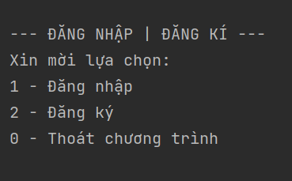
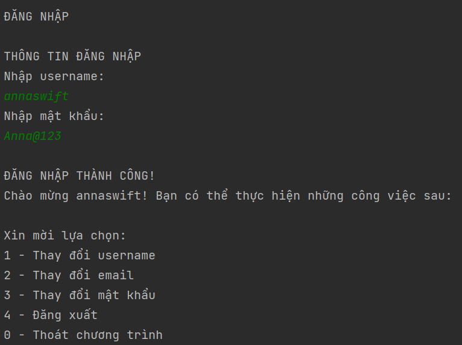
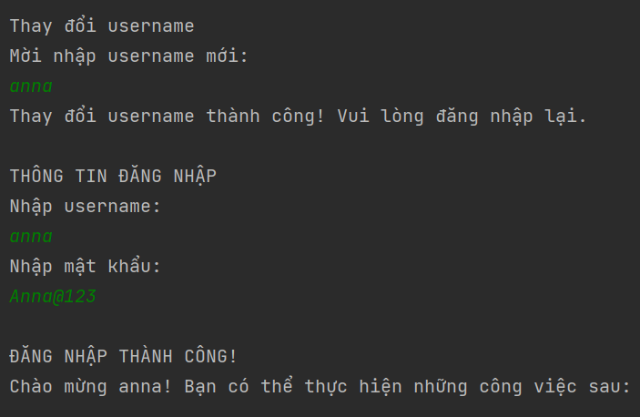
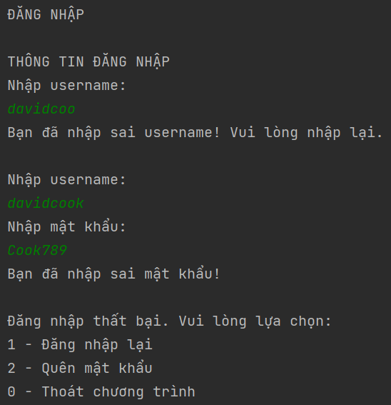
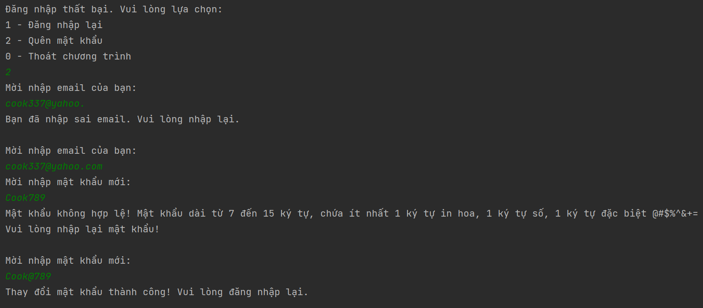
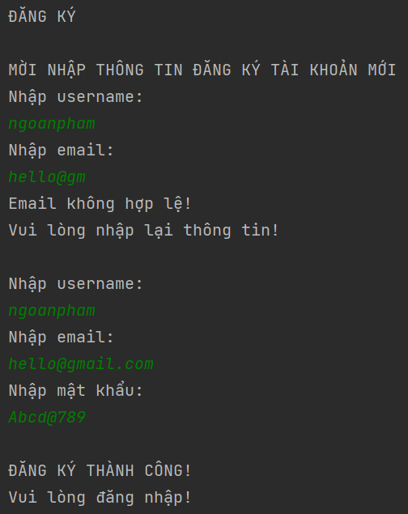
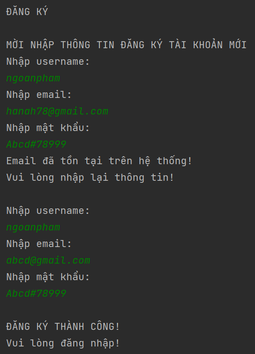

# Login Signup Account

Khi mới bắt đầu chương trình, người dùng có các lựa chọn:

- **1 - Đăng nhập**

- **2 - Đăng ký**

## 1. Đăng nhập

- Để đăng nhập, cần sử dụng username và password.

- Nếu nhập sai username thì thông báo “Kiểm tra lại username” và cho đăng nhập lại

- Nhập sai password thì hiện yêu cầu:

  - 1 - Đăng nhập lại

  - 2 - Quên mật khẩu

- Sau khi đăng nhập thành công, hiển thị “Chào mừng <user_name>, bạn có thể thực hiện các công việc sau:”

  - 1 - Thay đổi username

  - 2 - Thay đổi email

  - 3 - Thay đổi mật khẩu

  - 4 - Đăng xuất (Sau khi đăng xuất quay về mục yêu cầu đăng nhập hoặc đăng ký)

  - 0 - Thoát chương trình

- Quên mật khẩu

  - Tại mục quên mật khẩu thì có nhập email.

  - Nếu email đúng thì cho phép đổi mật khẩu và tiến hành đăng nhập. Nếu email sai thì báo chưa tồn tại tài khoản

## 2. Đăng ký

Để tạo tài khoản mới cần nhập username, email, password. Trong đó:

- Email phải chuẩn (Sử dụng regex), email và username chưa tồn tại trong List
- Password dài từ 7 đến 15 ký tự, chứa ít nhất 1 ký tự in hoa, 1 ký tự số, 1 ký tự đặc biệt @#$%^&+=

---

## App Images

0. Màn hình chính

- 

---

1. Đăng nhập, thay đổi username

- 
- 

---

2. Đăng nhập thất bại

- 

---

3. Quên mật khẩu

- 

---

4. Đăng ký

- 
- 
